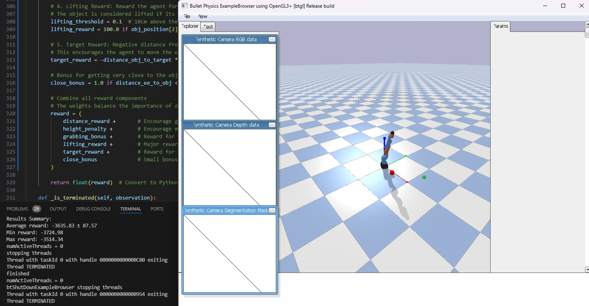

# GSPLAT RL Playground

**Simple summary:** GSPLAT RL Playground is a simulation environment for training robotic arms to manipulate various objects using reinforcement learning, with plans to integrate advanced features like object segmentation and real-world execution.

## Overview

GSPLAT RL Playground is a large-scale reinforcement learning (RL)-based robotic training system designed to explore robotic manipulation tasks in a controllable simulation environment. Built using PyBullet for physics simulation, it supports multiple object shapes and is compatible with OpenAI Gymnasium and Stable-Baselines3 for RL experimentation. The project follows a phased development approach:

1. **Phase 1**: Simple RL tasks with multiple object shapes (current phase)
2. **Phase 2**: Add object segmentation and reconstruction (future)
3. **Phase 3**: Bridge to real-world execution (future)
4. **Phase 4**: Advanced capabilities (future)

## Simulation Screenshot



*Figure 1: A screenshot of the simulation environment showing the robotic arm interacting with an object.*

## Features

- PyBullet-based physics simulation environment
- Multiple object shapes (Box, Sphere, Cylinder) with varying visual properties
- Randomized object shapes during training to improve generalization
- Observation space includes object position and orientation
- Compatible with OpenAI Gymnasium interface
- Stable-Baselines3 integration for seamless training and evaluation
- Configurable reward functions for reaching and pushing tasks
- Support for RGB rendering for visualization

## Getting Started

### Prerequisites

- Python 3.8+
- Git

### Installation

```bash
# Clone the repository
git clone https://github.com/kevdozer1/gsplat_RL_playground.git
cd gsplat_RL_playground

# On Windows
setup.bat

# On Linux/Mac
source wsl_env/bin/activate
```

### Usage

#### Quick Environment Test

Test the environment with a simple script:

```bash
python example.py
```

#### Training a Model

Train a model on the multi-shape environment:

```bash
python train_multiple_shapes.py --timesteps 200000 --num-envs 4
```

**Additional training options:**
- `--algo PPO|SAC`: Choose between PPO or SAC algorithm (default: PPO)
- `--continue-training`: Resume training from a previous model
- `--render`: Enable rendering during training
- `--cpu`: Force CPU usage even if CUDA is available

#### Running a Trained Model

Evaluate a trained model:

```bash
python run_model.py --model results/models/final_model_PPO.zip
```

**Additional options:**
- `--episodes N`: Number of episodes to run (default: 10)
- `--no-render`: Disable rendering
- `--algo PPO|SAC`: Specify the algorithm used for training

## Project Structure

- **`configs/`**: Configuration files (e.g., YAML files for environment settings)
- **`playground_rl/`**: Main package
  - **`environments/`**: RL environments
    - `simple_robot_env.py`: Core environment supporting multiple object shapes
  - **`models/`**: Model definitions
  - **`utils/`**: Utility functions
- **`results/`**: Training results and saved models
- **`example.py`**: Simple example script
- **`train_multiple_shapes.py`**: Training script for multi-shape environment
- **`run_model.py`**: Script to run and evaluate trained models

## Current Features (Phase 1)

- Simple robotic arm environment powered by PyBullet
- Multiple object shapes (Box, Sphere, Cylinder) with distinct visual properties
- Basic object manipulation tasks (reaching and attempting to manipulate objects)
- Training support for PPO and SAC algorithms via Stable-Baselines3
- Mesh visualization and loading utilities
- Configuration through YAML files
- Randomized object selection during training for enhanced generalization
- Observation space enriched with object orientation data

**Note:** The project is actively evolving. While the agent can reliably approach objects, successful grasping remains under development.

## Future Roadmap

### Phase 2: Incorporating Object Segmentation and Reconstruction
- Integrate a vision pipeline for object segmentation
- Implement Gaussian Splat reconstruction techniques
- Enable spawning of new object models in the simulation

### Phase 3: Bridging to Real-World Execution
- Set up and test with real robotic hardware
- Develop sim-to-real transfer techniques
- Calibrate the system for real-world performance

### Phase 4: Advanced Capabilities
- Support multi-robot scenarios
- Introduce generative environment variation
- Implement automated curriculum learning

## Contributing

Contributions are welcome! Please feel free to submit a Pull Request to enhance the project.

## License

MIT License

## Acknowledgments

- **PyBullet**: For providing the physics simulation engine
- **OpenAI Gymnasium**: For the RL environment interface
- **Stable-Baselines3**: For robust RL algorithm implementations
